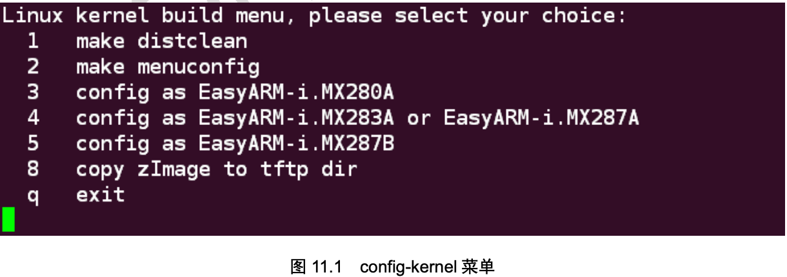
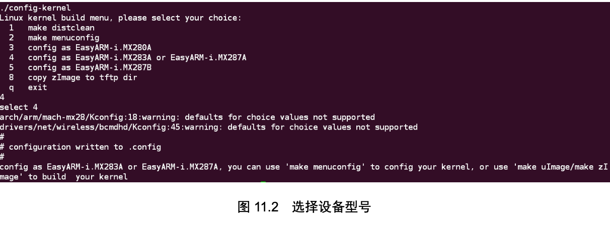

# 11.1 编译内核

参考 10.5 节内容准备好 `mkimage` 文件，并复制到 `/usr/bin/` 目录下（使用 ZLG 官网提供的 Ubuntu 则不需要操作这一步）。

```bash
sudo cp mkimage /usr/bin/
```

## 11.1.1 解压内核文件

请把光盘中的 `linux-2.6.35.3.tar.bz2` 复制到 Linux 主机硬盘的工作目录，然后解压该压缩包：

```bash
tar -jxvf linux-2.6.35.3.tar.bz2
```

解压完成之后得到 `linux-2.6.35.3` 目录，运行以下命令，进入该目录：

```bash
cd linux-2.6.35.3
```

---

## 11.1.2 设置内核对应的型号

由于 **EasyARM-i.MX280A**、**EasyARM-i.MX283A**、**EasyARM-i.MX287A** 是同一份内核代码，所以我们在配置、编译内核代码之前，需要先设置我们的设备型号。进入内核源码的根目录后，输入命令：

```bash
./config-kernel
```

该命令将打印如图 11.1 所示的菜单。

这里用户可以根据自己的设备型号输入对应数字，然后再输入 "Enter" 确认，如图 11.2 所示，其中：


- **3** —— 把内核配置成 EasyARM-i.MX280A 使用
- **4** —— 把内核配置成 EasyARM-i.MX283A 或 EasyARM-i.MX287A 使用（注意这两个型号是用同一配置的内核代码）
- **5** —— 把内核配置成 EasyARM-i.MX287B 使用

---

## 11.1.3 备份内核配置文件

> **⚠️ 注意**：默认的内核配置文件为 `.config`，如需修改内核配置，请提前备份。

具体方法为在 `linux-2.6.35.3` 目录下执行以下命令（假如您的设备是 EasyARM-i.MX283A）：

```bash
cp .config EasyARM-iMX283A_backup_defconfig
```

恢复为原来的内核配置时只需拷贝回原来的 config 文件即可：

```bash
cp EasyARM-iMX283A_backup_defconfig .config
```

💡 `EasyARM-iMX283A_backup_defconfig` 只是示例名字，用户可以自行定义。此外在 `arch/arm/configs/` 目录下也有备份的配置文件。

## 11.1.4 编译内核

在 `linux-2.6.35.3` 目录下执行 `make uImage` 命令即可编译。编译完成后将在 `arch/arm/boot/` 目录下生成 **uImage** 内核固件文件。

---

# 11.2 生成 imx28_ivt_linux.sb 内核固件

`imx28_ivt_linux.sb` 内核固件是可以让系统直接从 Linux 内核中启动，而不需要 U-Boot 的引导，从而减少了系统的开机时间。

制作 `imx28_ivt_linux.sb` 固件首先需要制作出来 `zImage` 文件。这需要进入内核代码目录，输入 `make zImage` 命令进行编译：

```bash
cd linux-2.6.35.3
make zImage
```

编译完成后将在 `arch/arm/boot/` 目录下生成 `zImage` 文件。把这个 `zImage` 文件复制到 `imx-bootlets-src-10.12.01` 目录下（见 10.3 节）。进入 `imx-bootlets-src-10.12.01` 目录，然后输入 `./build` 命令：

```bash
cd imx-bootlets-src-10.12.0
./build
```

命令执行完成后，将在 `imx-bootlets-src-10.12.01` 目录下生成 `imx28_ivt_linux.sb` 固件。

---

## 启动参数配置

Linux 内核启动时，是需要传入启动参数的：

- 若 Linux 内核是由 **U-Boot 引导启动**时，启动参数是由 U-Boot 传递的
- 但是若系统**直接从 Linux 内核启动**，其启动参数则由 bootlets 中的 `linux_prep` 传递

在 `imx-bootlets-src-10.12.01` 目录下 `linux_prep/cmdlines/iMX28_EVK.txt` 文件内容如下：

```
gpmi=g console=ttyAM0,115200n8 console=tty0 ubi.mtd=1 root=ubi0:rootfs rootfstype=ubifs fec_mac= ethact
```

`linux_prep/board/iMX28_EVK.c` 文件的 `cmdline_def` 变量（在该文件的最后一行）的值为：

```c
char cmdline_def[] = "gpmi=g console=ttyAM0,115200n8 ubi.mtd=1 root=ubi0:rootfs rootfstype=ubifs fec_mac=ethact";
```

> **⚠️ 重要**：当用户需要修改 `imx28_ivt_linux.sb` 的启动参数时，这两个地方也要修改，而且内容要一致。

---

## 烧写固件

生成 `imx28_ivt_linux.sb` 固件后，可以进行烧写：

### �� USB 方式烧写

如果使用 USB 方式烧写到开发套件的 NAND Flash 时，请把该固件文件替换到 MfgTool 程序的以下目录：

```
EasyARM-i.MX283A\MfgTool 1.6.2.055-ZLG140813\Profiles\MX28 Linux Update\OS Firmware\files
```

### 📌 SD 方式烧写

如果使用 SD 方式烧写到开发套件的 NAND Flash 时，请把该固件文件替换到以下目录：

```
EasyARM-i.MX283A\MfgTool 1.6.2.055-ZLG140813\Profiles\MX28 Linux Update\OS Firmware\files
```

> **📝 注**：目录中的 `EasyARM-i.MX283A` 为具体开发套件对应的型号名称，请选实际型号对应的目录。
